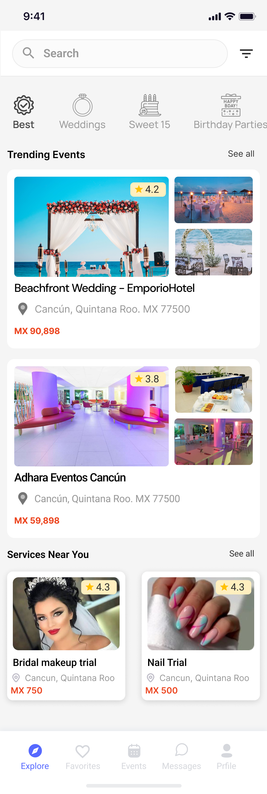
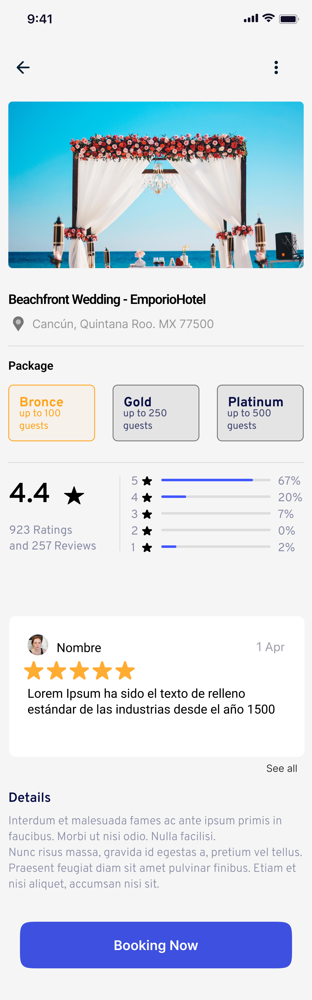
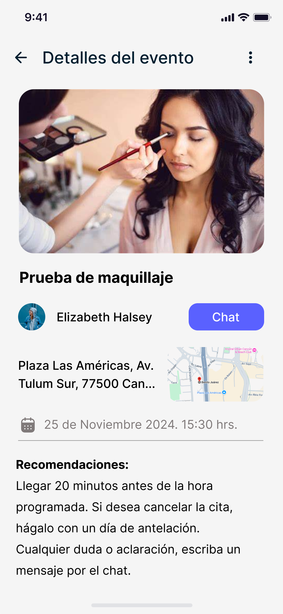
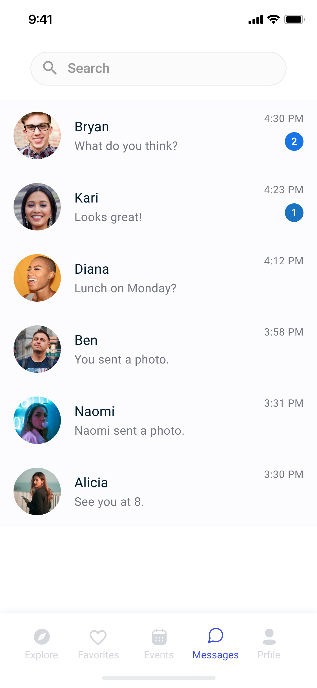
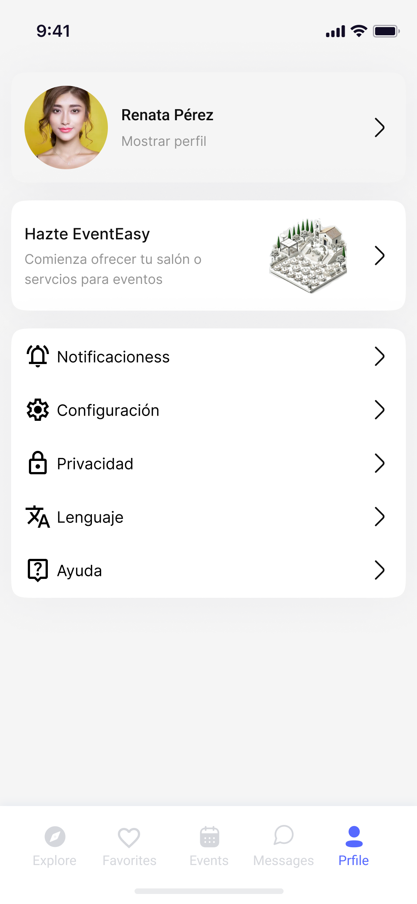

#EventEasy

Aplicacion que permite a las personas rentar o ser locatario de espacio como salones, fincas, jardines, etc; para diferentes tipos de eventos. Asi mismo, permite que los usuarios ofrencan o paguen servicios como maquillaje, Musica, Fotografias, etc.

> Dashboard para el personal

> Pantalla Explore

> Detalles

> Evento

> Mesajes

> Evento

## Tecnologías Utilizadas

- Frontend: Kotlin, AN
- Backend: Express
- Base de Datos: MongoDB
